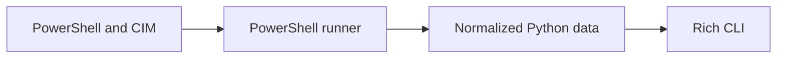

# ArgOS

> A modular Windows administration and diagnostics CLI that turns PowerShell system data into structured, readable insights.


.gif)

ArgOS brings Windows system information, diagnostics, and security investigation into a consistent terminal interface built with Python, PowerShell, and Rich.

The current pre-alpha version provides an interactive CLI, administrator privilege detection, structured PowerShell execution, internal logging, and a system-information module.

> [!IMPORTANT]
> ArgOS is under active development. The system-information collector and core PowerShell layer are available now; most other modules described in the roadmap are planned.

## ✨ Available Now

- Interactive Rich-powered main menu
- Windows administrator privilege detection
- Automatic PowerShell 7 and Windows PowerShell detection
- Centralized and structured PowerShell execution
- Internal application logging
- System, hardware, BIOS, storage, CPU, memory, and GPU information
- Normalized JSON-compatible results

ArgOS prefers PowerShell 7 (`pwsh`) and falls back to Windows PowerShell when necessary. PowerShell results are converted to JSON and returned to Python as structured data.

## 🚀 Quick Start

### Requirements

- Windows 10 or Windows 11
- Python 3.11 or later
- PowerShell 7 or Windows PowerShell 5.1

### Installation

Clone the repository and enter the project directory:

```powershell
git clone https://github.com/wglgc997/ArgOS.git
cd ArgOS
```

Create and activate a virtual environment:

```powershell
python -m venv .venv
.\.venv\Scripts\Activate.ps1
```

Install and start ArgOS:

```powershell
python -m pip install --upgrade pip
python -m pip install .
argos
```

You can also run the application as a Python module:

```powershell
python -m argos
```

## 🖥️ Usage

Start ArgOS from an activated virtual environment:

```powershell
argos
```

The main screen displays the current administrator privilege level and the available modules. Select `System information` to collect structured Windows, hardware, storage, BIOS, and PowerShell details.

Some future administration and security operations will require an elevated PowerShell terminal.

## 📋 Example Output

Values vary by computer, but the collected data follows this structure:

```python
{
    "Computer": "WORKSTATION-01",
    "WindowsVersion": {
        "Name": "Microsoft Windows 11 Enterprise",
        "Version": "10.0.26100",
        "Build": "26100",
    },
    "Architecture": "64-bit",
    "CPU": {
        "Name": "Processor model",
        "Cores": 8,
        "LogicalProcessors": 16,
    },
    "Memory": {"TotalGB": 32.0, "FreeGB": 18.4},
    "Storage": [...],
    "GPU": [...],
    "BaseBoard": {...},
    "BIOS": {...},
    "PowerShell": "7.5.0",
}
```

## 🏗️ How It Works



The PowerShell integration is centralized in `argos/core/`. Individual modules collect and normalize domain data before the application presents it through the shared Rich interface.

## 🧰 Technologies

- **Core:** Python 3.11+, PowerShell
- **Interface:** Rich, Questionary
- **System integration:** psutil, pywin32
- **Templates:** Jinja2
- **Development:** pytest, Ruff, mypy

## 📁 Project Structure

```text
ArgOS/
├── argos/
│   ├── core/                 # PowerShell runner and reusable commands
│   ├── models/               # Shared findings and severity models
│   ├── modules/              # Administration and investigation modules
│   ├── ui/                   # Rich console helpers and visual theme
│   └── app.py                # Interactive application entry point
├── docs/
│   └── epics.md              # Detailed roadmap and project progress
├── main.py                   # Source-tree compatibility entry point
├── pyproject.toml            # Package metadata and tool configuration
└── requirements.txt          # Development dependency list
```

## 🗺️ Roadmap

- [x] Application foundation and interactive CLI
- [x] PowerShell integration and administrator detection
- [ ] Complete system-information presentation
- [ ] Windows Event Log analysis
- [ ] Processes and services
- [ ] Network diagnostics
- [ ] Local security audit
- [ ] Reports and exports
- [ ] Tests, CI/CD, packaging, and releases

See the [Project Epics](docs/epics.md) for the complete development plan.

## ⚠️ Safety and Scope

ArgOS is an administration and investigation aid. It is not an antivirus, EDR platform, or replacement for professional incident-response tooling.

Read-only collection is preferred by design. Features that change system state, such as terminating processes or controlling services, are planned to require explicit confirmation. Review commands before using the project on production systems.

## 🧪 Development

Install ArgOS with its development dependencies:

```powershell
python -m pip install -e ".[dev]"
```

Run the currently configured static quality checks:

```powershell
ruff check .
mypy argos
```

The automated test suite and CI workflow are planned as part of the quality and release epic.

## 🤝 Contributing

Contributions, bug reports, and suggestions are welcome. To contribute:

1. Fork the repository and create a focused branch.
2. Keep PowerShell execution inside `argos/core/powershell.py` and reusable commands inside `argos/core/powershell_commands.py`.
3. Add or update tests when introducing behavioral changes.
4. Run the available quality checks before opening a pull request.

For larger features, [open an issue](https://github.com/wglgc997/ArgOS/issues) first so the scope can be aligned with the roadmap.

## 👤 Author

Created by [Wagner Carvalho](https://github.com/wglgc997) as a practical project focused on Windows administration, PowerShell automation, infrastructure diagnostics, and Python software engineering.

## 📄 License

Distributed under the MIT License. See [`LICENSE`](LICENSE) for details.
